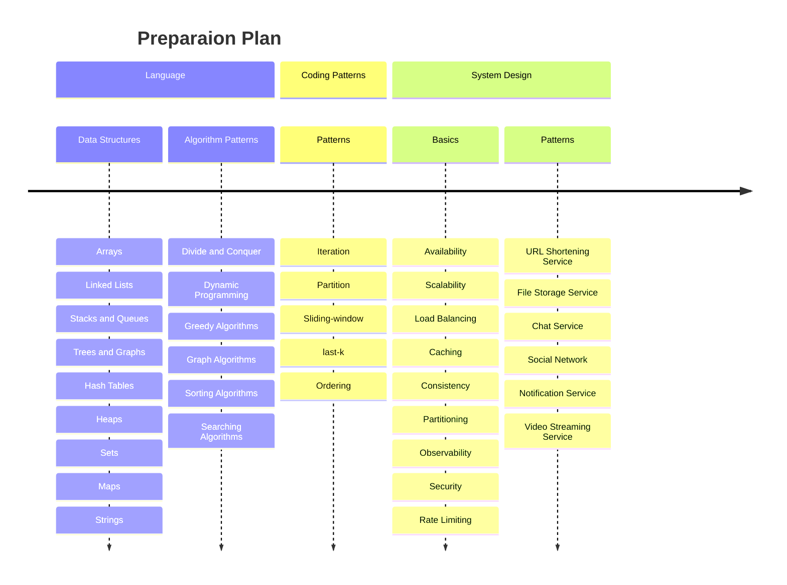
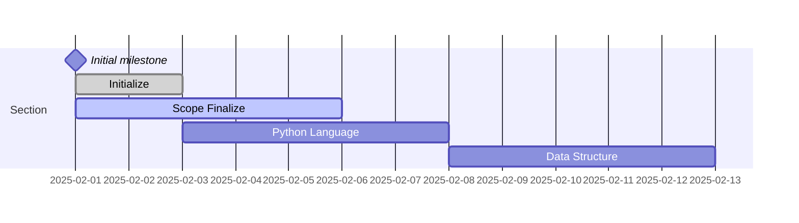

# Coding & System Design Patterns in Python

This repository is a collection of coding and system desing patterns in Python. This repo contains a collection of
patterns for solving coding problems and system design problems. The patterns are organized in a way that makes it easy
to understand and apply them to solve problems.

- [Scope](doc/ch00-scope.md)

## Roadmap

## Table of Contents

### Part A: Language & Data Structures

- [Introduction](doc/A-language-and-ds/ch01-introduction.md)
- [Language: Python](doc/A-language-and-ds/ch02-python.md)
- [Troubleshooting](doc/A-language-and-ds/ch03-troubleshooting.md)

### Part B: Coding Patterns

- [Iteration](doc/B-coding-patterns/ch03-itertion.md)
- [Partition](doc/B-coding-patterns/ch04-partition.md)
- [Sliding-window](doc/B-coding-patterns/ch05-sliding-window.md)
- [last-k](doc/B-coding-patterns/ch06-last-k.md)
- [Lexicographic Order](doc/B-coding-patterns/ch07-lexicographic-order.md)
- [Backtracking](doc/B-coding-patterns/ch08-backtracking.md)
- [Merge](doc/B-coding-patterns/ch09-merge.md)

### Part C: System Design Basics

- [System Design Basics](doc/C-system-design-basics/ch01-system-design-basics.md)
- [Linux Internal](doc/C-system-design-basics/ch02-linux-internal.md)
- [Database Internal](doc/C-system-design-basics/ch03-database-internal.md)
- [Socket & Web Socket](doc/C-system-design-basics/ch04-socket-and-websocket.md)
- [Replication](doc/C-system-design-basics/ch05-replication.md)
- [API Gateway](doc/C-system-design-basics/ch06-api-gateway.md)
- [CDN](doc/C-system-design-basics/ch08-cdn.md)
- [Serverless](doc/C-system-design-basics/ch09-serverless-architecture.md)
- [Caching](doc/C-system-design-basics/ch10-caching.md)
- [Stateful vs Stateless Architecture](doc/C-system-design-basics/ch11-stateful-vs-stateless-architecture.md)
- [Proxy](doc/C-system-design-basics/ch12-proxy.md)
- [Observability](doc/C-system-design-basics/ch13-observability.md)

### Part D: System Design Problems & Code

## References

- [MD Cheatsheet](https://docs.github.com/en/get-started/writing-on-github/getting-started-with-writing-and-formatting-on-github/quickstart-for-writing-on-github)
