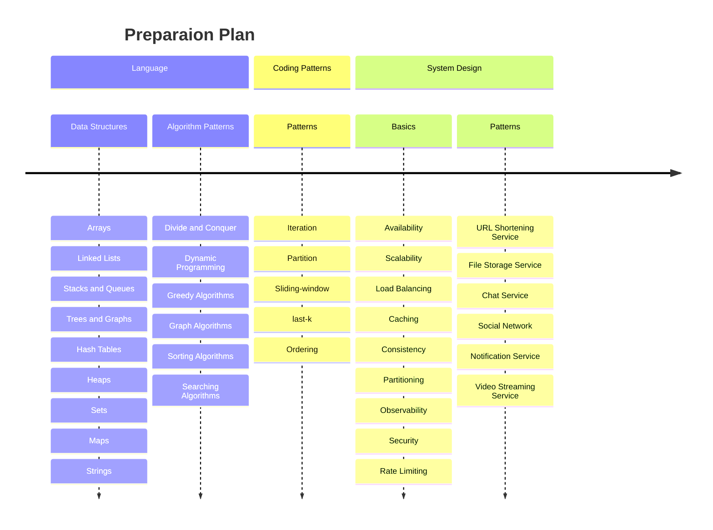
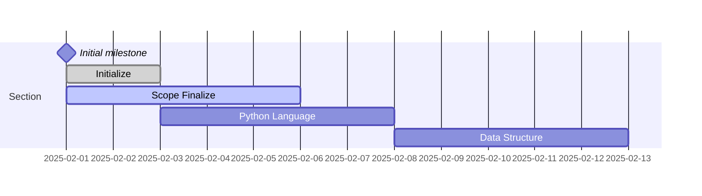

# Coding & System Design Patterns in Python

This repository is a collection of coding and system desing patterns in Python. This repo contains a collection of
patterns for solving coding problems and system design problems. The patterns are organized in a way that makes it easy
to understand and apply them to solve problems.

- [Scope](doc/ch00-scope.md) 

# Roadmap

# Table of Contents
## Part A: Language & Data Structures
- [Introduction](doc/ch01-introduction.md)
- [Language: Python](doc/ch02-python.md)

## Part B: Coding Patterns
- [Iteration](doc/ch03-itertion.md)
- [Partition](doc/ch04-partition.md)
- [Sliding-window](doc/ch05-sliding-window.md)
- [last-k](doc/ch06-last-k.md)
- [Lexicographic Order](doc/ch07-lexicographic-order.md)
- [Backtracking](doc/ch08-backtracking.md)
- [Merge](doc/ch09-merge.md)

## Part C: System Design Basics

## Part D: System Design Problems & Code

# References

- [MD Cheatsheet](https://docs.github.com/en/get-started/writing-on-github/getting-started-with-writing-and-formatting-on-github/quickstart-for-writing-on-github)

